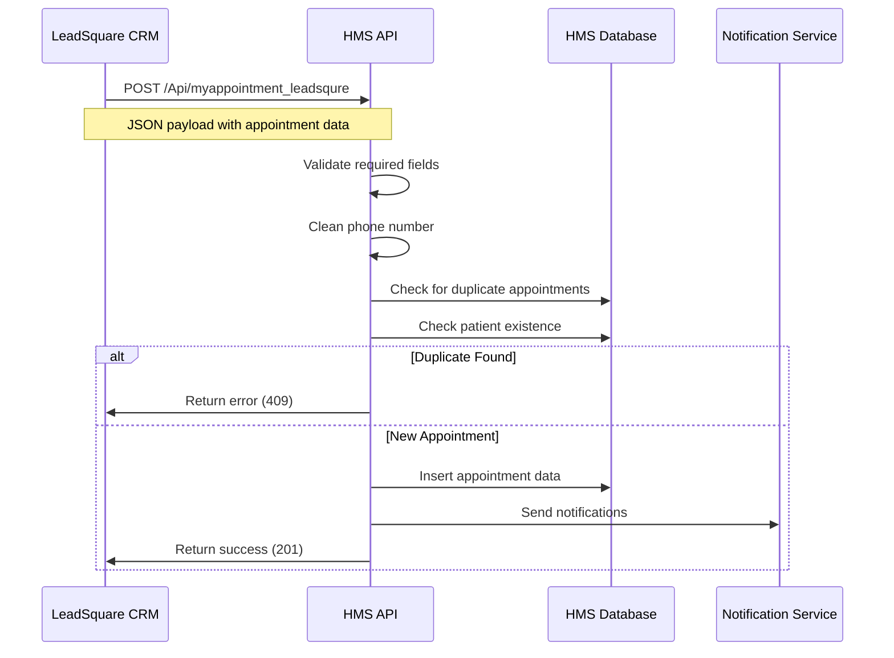

# CRM to Appointment Integration Documentation

## Overview

This document provides comprehensive documentation for the CRM (Customer Relationship Management) to Appointment data flow in the HMS (Hospital Management System). The system integrates with LeadSquare CRM to automatically create appointments when leads are generated or updated.

## Table of Contents

1. [System Architecture](#system-architecture)
2. [API Endpoints](#api-endpoints)
3. [Data Flow Process](#data-flow-process)
4. [Database Schema](#database-schema)
5. [Validation Rules](#validation-rules)
6. [Error Handling](#error-handling)
7. [Configuration](#configuration)
8. [Troubleshooting](#troubleshooting)
9. [API Reference](#api-reference)

## System Architecture

### Components

```
┌─────────────────┐    ┌──────────────────┐    ┌─────────────────┐
│   LeadSquare    │───▶│   HMS API Layer  │───▶│  HMS Database   │
│      CRM        │    │                  │    │                 │
└─────────────────┘    └──────────────────┘    └─────────────────┘
                              │
                              ▼
                       ┌──────────────────┐
                       │  Notification    │
                       │    Services      │
                       └──────────────────┘
```

### Key Files

- **API Controller**: `application/controllers/Api.php`
- **Modern API Controller**: `application/controllers/Api/AppointmentApi.php`
- **Appointment Model**: `application/models/Appointment_model.php`
- **Billing Model**: `application/models/Billingmodel_model.php`
- **Database Table**: `hms_appointments`

## API Endpoints

### Primary Endpoint

**URL**: `POST /Api/myappointment_leadsqure`

**Purpose**: Receives appointment data from LeadSquare CRM

**Authentication**: None (webhook endpoint)

**Content-Type**: `application/json`

### Modern Endpoint

**URL**: `POST /api/appointment/leadsquare`

**Purpose**: Modern API endpoint for LeadSquare integration

**Authentication**: Required (API token)

**Content-Type**: `application/json`

## Data Flow Process

### 1. Data Reception



### 2. Data Processing Steps

1. **JSON Parsing**: Extract data from incoming JSON payload
2. **Field Validation**: Check required fields (FirstName, Phone)
3. **Phone Cleaning**: Remove "+91-" prefix from phone numbers
4. **Duplicate Check**: Verify no existing appointments for the phone number
5. **Patient Lookup**: Check if patient exists in the system
6. **Data Mapping**: Map CRM data to internal appointment structure
7. **Center Mapping**: Convert CRM center codes to internal center IDs
8. **Database Insert**: Store appointment in `hms_appointments` table
9. **Notifications**: Send WhatsApp/SMS notifications
10. **Response**: Return success/error status to CRM

## Database Schema

### Primary Table: `hms_appointments`

| Column | Type | Description | Source |
|--------|------|-------------|---------|
| `ID` | INT | Primary key (auto-increment) | System |
| `paitent_id` | VARCHAR | Patient identifier (GUID) | Generated/Existing |
| `paitent_type` | ENUM | 'new_patient' or 'exist_patient' | Determined |
| `wife_name` | VARCHAR | Patient name | CRM FirstName |
| `husband_name` | VARCHAR | Husband name | CRM HusbandName |
| `wife_phone` | VARCHAR | Phone number (cleaned) | CRM Phone |
| `wife_email` | VARCHAR | Email address | CRM EmailAddress |
| `nationality` | VARCHAR | Patient nationality | Default: 'indian' |
| `crm_id` | VARCHAR | CRM Lead ID | CRM LeadID |
| `reason_of_visit` | TEXT | Visit reason | CRM ActivityNote |
| `appoitment_for` | VARCHAR | Center ID | Mapped from CRM |
| `appoitmented_doctor` | VARCHAR | Doctor ID | CRM Fields |
| `appoitmented_date` | DATE | Appointment date | CRM Fields |
| `appoitmented_slot` | TIME | Time slot | CRM Fields |
| `appointment_added` | DATETIME | Creation timestamp | System |
| `status` | ENUM | Appointment status | Default: 'booked' |

### Supporting Tables

- **`hms_patients`**: Patient master data
- **`hms_centers`**: Center/location information
- **`hms_doctors`**: Doctor information

## Validation Rules

### Input Validation

| Field | Required | Validation | Error Response |
|-------|----------|------------|----------------|
| `FirstName` | Yes | Not empty | 400 Bad Request |
| `Phone` | Yes | Not empty | 400 Bad Request |
| `EmailAddress` | No | Valid email format | N/A |
| `LeadID` | No | String | N/A |
| `ActivityNote` | No | Text | N/A |
| `Fields` | No | Array | N/A |

### Business Rules

1. **Duplicate Prevention**: Only one active appointment per phone number
2. **Status Check**: Only checks 'booked' and 'rescheduled' statuses
3. **Phone Format**: Automatically removes "+91-" prefix
4. **Patient Type**: Determined by existence in patient table
5. **Center Mapping**: Maps CRM codes to internal center IDs

### Data Transformation

```php
// Phone number cleaning
$mobile = str_replace("+91-", "", $data['Phone']);

// Email validation
$email = !empty($data['EmailAddress']) ? $data['EmailAddress'] : "";

// Patient type determination
if (patient_exists($mobile)) {
    $patient_type = "exist_patient";
    $patient_id = get_existing_patient_id($mobile);
} else {
    $patient_type = "new_patient";
    $patient_id = generate_guid();
}
```

## Error Handling

### HTTP Status Codes

| Code | Description | Scenario |
|------|-------------|----------|
| 200 | Success | Appointment created successfully |
| 400 | Bad Request | Missing required fields |
| 409 | Conflict | Duplicate appointment exists |
| 500 | Internal Server Error | Database or system error |

### Error Response Format

```json
{
    "status": 0,
    "message": "Error description",
    "data": null
}
```

### Common Error Scenarios

1. **Missing Required Fields**
   ```json
   {
       "status": 0,
       "message": "FirstName and Phone are required"
   }
   ```

2. **Duplicate Appointment**
   ```json
   {
       "status": 0,
       "message": "Appointment already booked"
   }
   ```

3. **Database Error**
   ```json
   {
       "status": 0,
       "message": "Something went wrong!"
   }
   ```

## Configuration

### Database Configuration

```php
// application/config/_config.php
$config['db_prefix'] = 'hms_';
```

### Center Mapping

```php
$centerArr = array(
    "101" => "16249589462327",
    "102" => "16266778858144",
    "103" => "16267558222750",
    // ... more mappings
);
```

### CRM Field Mapping

| CRM Field | Internal Field | Description |
|-----------|----------------|-------------|
| `mx_Centre_Location` | `appoitment_for` | Center ID |
| `mx_Doctor` | `appoitmented_doctor` | Doctor ID |
| `mx_appoitmented_date` | `appoitmented_date` | Appointment date |
| `mx_appoitmented_slot` | `appoitmented_slot` | Time slot |

## API Reference

### Request Format

```json
{
    "EmailAddress": "patient@example.com",
    "ActivityNote": "Consultation for fertility treatment",
    "LeadID": "LS123456",
    "FirstName": "Priya",
    "HusbandName": "Raj",
    "Phone": "+91-9876543210",
    "ActivityDateTime": "2024-01-15 10:00:00",
    "Fields": [
        {
            "SchemaName": "mx_Centre_Location",
            "Value": "101"
        },
        {
            "SchemaName": "mx_Doctor",
            "Value": "DOC001"
        },
        {
            "SchemaName": "mx_appoitmented_date",
            "Value": "2024-01-15"
        },
        {
            "SchemaName": "mx_appoitmented_slot",
            "Value": "10:00 AM"
        }
    ]
}
```

### Success Response

```json
{
    "status": 1,
    "message": "Appointment has been booked!",
    "data": {
        "appointment_id": 12345
    }
}
```

### Error Response

```json
{
    "status": 0,
    "message": "Appointment already booked",
    "data": null
}
```

## Troubleshooting

### Common Issues

1. **Appointment Not Created**
   - Check required fields (FirstName, Phone)
   - Verify phone number format
   - Check for duplicate appointments

2. **Wrong Center Mapping**
   - Verify center code in mapping array
   - Check CRM field name (`mx_Centre_Location`)

3. **Patient Not Found**
   - Check phone number format
   - Verify patient exists in `hms_patients` table

4. **Database Errors**
   - Check database connection
   - Verify table structure
   - Check field constraints

### Debug Steps

1. **Enable Logging**
   ```php
   // Add to controller
   error_log("CRM Data: " . json_encode($data));
   ```

2. **Check Database Queries**
   ```php
   // Enable query logging
   $this->db->db_debug = TRUE;
   ```

3. **Validate Input Data**
   ```php
   // Add validation logging
   error_log("Validated Data: " . json_encode($appoint_arr));
   ```

### Log Files

- **Application Logs**: `application/logs/`
- **Error Logs**: Check web server error logs
- **Database Logs**: Enable MySQL query logging

## Security Considerations

1. **Input Sanitization**: All input data is sanitized using `addslashes()`
2. **SQL Injection Prevention**: Uses parameterized queries
3. **Data Validation**: Strict validation of required fields
4. **Error Handling**: No sensitive data exposed in error messages

## Performance Considerations

1. **Database Indexing**: Ensure proper indexes on phone number and patient ID
2. **Query Optimization**: Use efficient queries for duplicate checks
3. **Caching**: Consider caching center and doctor mappings
4. **Rate Limiting**: Implement rate limiting for API endpoints

## Future Enhancements

1. **Real-time Sync**: Implement real-time bidirectional sync
2. **Webhook Retry**: Add retry mechanism for failed webhooks
3. **Audit Trail**: Track all appointment changes
4. **Analytics**: Add appointment analytics and reporting
5. **Multi-CRM Support**: Support for multiple CRM systems

## Support

For technical support or questions regarding this integration:

1. Check this documentation first
2. Review application logs
3. Contact development team
4. Create issue in project repository

---

**Last Updated**: January 2025
**Version**: 1.0
**Author**: HMS Development Team
